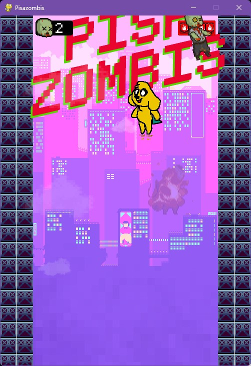

# Pisazombis 
Este es un prototipo de un juego arcade en el que un personaje (Mikecrack, de Los Compas) va destruyendo zombis mientras cae entre edificios en ruinas en un apocalipsis. Debe esquivar objetos explosivos y tratar de mantenerse en el aire el mayor tiempo posible para eliminar todos los zombis que pueda. El juego termina al llegar al suelo.

Programado en Python 3.11.0 con PyGame 2.5.2 / PyGame-ce 2.3.2.

## Controles
`ESPACIO` para empezar a jugar  
⬅️ ➡️ para mover al personaje  
`ESCAPE` para volver a la pantalla de inicio durante el juego  

Lo siento por la música; tenía que ser esa.

---
_Excepto los sprites provisionales del jugador, el resto del apartado artístico (ilustraciones, fuentes, sonidos) pertenece a sus respectivos propietarios._